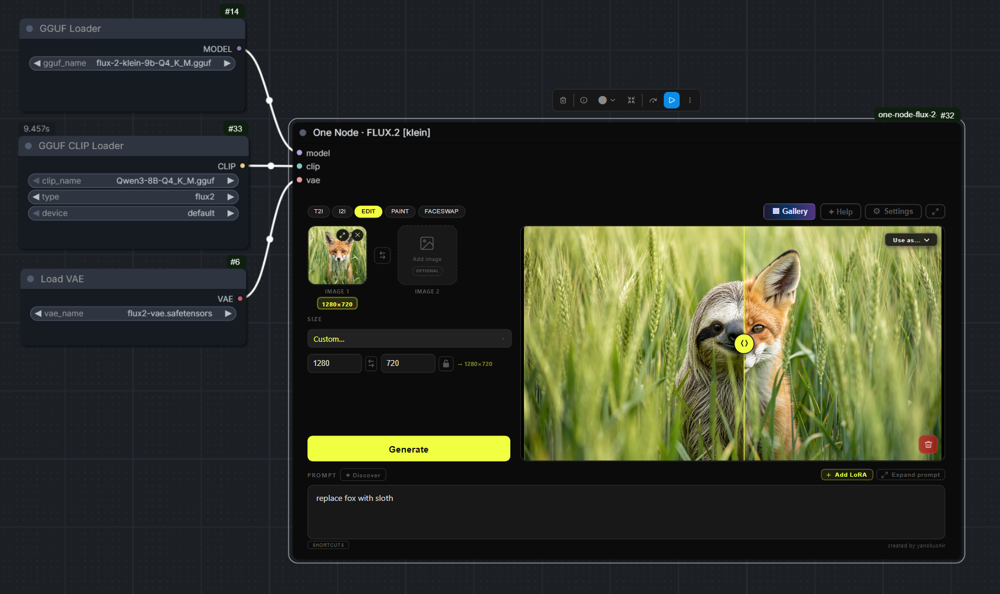

# One Node Canvas · FLUX.2 [klein]

An infinite design board for FLUX.2 [klein], inside a single ComfyUI node.

No graph to build and no wires to connect. You get a pannable, zoomable canvas where images are
frames you arrange, connect and iterate on — closer to a design tool than a node editor. Built
for product and apparel work: concepting, colourways, technical flats and handoff.

<!-- TODO: record a short demo of the board and drop it in as assets/demo.gif -->

---

## What it is

The node is one DOM widget hosting a **board**. Two kinds of thing live on it:

**Frames** — images. Generated results, uploads, sketches, or anything from the gallery. Drag,
group, tag, rename and arrange them.

**Blocks** — the things that make images. Connect one or more frames to a block, pick what it
should do, and press Generate. The results land back on the board, linked to their sources so
you can trace where anything came from.

Boards are saved as **projects** and persist across restarts.

## What it does

Select frames and open **Actions**, or connect them to a block:

**Render** — re-render from the prompt. With a source it holds the composition; without one it
generates from text and offers an aspect-ratio row.

**Variations** — alternatives around the same design. Explores form, deliberately holding the
palette.

**New Views** — front, side, rear, 3/4, top or detail. One queued generation per view selected,
consistent product and materials across all of them.

**Modify** — change something by instruction. The one that repaints materials and colours while
holding the silhouette.

**Render sketch** — turn a line drawing into a finished render, holding its design. The prompt is
optional here: the drawing already says what to make, so you only add materials, colour or
setting. Image-to-image cannot do this at any strength — it holds the drawing's tonal structure
and hands you back a shaded line drawing — so this uses the reference-conditioned path instead.

**Refine** — a finishing pass at the same size. Not an upscale.

**Expand** — grow the frame outwards and let the model invent the new area.

**Cut out** — lift the subject off its background to a transparent PNG.

**Upscale** — 2×, 4×, 6× or 8× with SeedVR2.

**Extract Colors** — pull a palette out of an image, edit the swatches, save it to your library.

**Animate** — a short clip from a still, 2, 4 or 6 seconds, at the frame's own aspect ratio.
Pick an image, describe the movement, and the finished clip lands on the board beside it.
Point at it to play, move away to stop; double-click opens it full size. It moves, groups,
tags, renames and saves with everything else, and the mp4 goes to your output folder too.
Needs its own model — see Models below.

A clip shows its first frame when it is not playing, which is also what every other tool
reads off it: run Extract Colors or Variations on a clip and you get the palette of, or
variations on, that first frame. The Actions panel says so before you press Generate. The
layer editor declines a clip — there is nothing to paint on.

**Waypoints.** Select two to four board images and Animate lays them along the clip: the
first is frame 0, the last is the final frame, the rest evenly spaced. The clip then travels
through them. Front, three-quarter, side gives a clean ninety-degree turntable in four
seconds. The panel shows the order it will use — which is the order you selected them in,
and a marquee does not control that — with a Reverse button.

Keep the move going one way. A sequence that doubles back (A to B to A) collapses the subject
where it turns; that was measured, not guessed.

Waypoints are the answer to "it barely rotates". Without them the model paces whatever motion
it settles on across the length it is given, so six seconds does not turn further than two,
and no amount of prompting changes that. Two things that sound like they should help and do
not: spatiotemporal guidance made no visible difference at cfg 1 on the distilled model, and
lowering the conditioning frame rate produced far more motion along with a second porthole,
sprouting legs and a morphing body.

**Choosing the model.** Video Model and Video Text Encoder live in Settings beside the
SeedVR2 pair. Both default to "none", which means "use whatever the workflow template names"
— so an install that never opens Settings behaves exactly as it always did. The panel checks
the checkpoint is installed before offering to run.

On LTX 2.x: it is a 22B model — 21.5 GB for the int8 transformer plus 15.4 GB for its Gemma-4
text encoder — and Lightricks' own ComfyUI node pack asks for 32 GB of VRAM. It will not run
usefully on a 24 GB card. Everything above was gained from the 2B model and the node suite
that is already installed.

**Pose** and **Faceswap** — copy a pose, or a face, from a second image.

### Suggestions

An empty prompt box in front of a connected image is the most common place to stall. Press
**✦ Suggest** and the block reads the image and offers things to type: a description of what it
sees, and edits naming the parts it actually found — "change the wheel", not a generic verb.

A suggestion is offered, never applied. The button asks, a chip fills the box, and the row
disappears once you have written something of your own rather than offering to overwrite it.
Results are cached per image, so asking twice costs nothing.

The caption is a starting point to edit, not a statement of fact — it will occasionally name a
brand that is not there.

### Reference images

Any source connected to a block starts as **Composite** — several sources are merged into one
image and worked on together. Click the label on the connection line to switch a source to
**Reference** instead, and it becomes a style donor rather than content: its colours and
materials influence the result while the other source supplies the shape.

This is how you apply the look of one image to the drawing of another. It works on the
instruction-driven modes — Modify, New Views and the restaging Variations presets.

### Organising the board

**Lineage** — every generated frame records what it came from. Ask any frame to show its
ancestry and the chain back to the original source is drawn on the board.

**Groups and tags** — collect related frames into a named group, or tag them and use search to
select every match at once.

**Sections** — turn a group into a labelled, tinted region drawn behind its frames, so a board
that has grown to forty images still says where the concept stage ends and the marketing stage
begins. A section takes the group's own tag colour; groups without one are unchanged.

**Compare** — put two frames side by side with a wipe, to judge a change properly rather than by
memory.

**Contact sheet** — lay a selection out as a single sheet for review or handoff.

**Arrange** — align and distribute a selection, so a board stays readable once it has fifty
images on it.

### The editor

Double-click a frame for a layered editor: brush, eraser, fill, line, rectangle, ellipse, lasso,
move and transform, with optional mirrored symmetry. Paint an inpaint mask and regenerate only
that area, blend a layer in, or run any board action from inside it.

Export the whole document as a layered **PSD**, or any single layer as PNG.

#### Selecting

Five ways to select, cycled with **Q**: lasso, brush, bezier, **Auto select** — one click detects
the whole subject — and **Pick part**, which segments whatever you click. Click a wheel and you
get the wheel, not the car. Shift-click adds a second region to the same selection.

Pick part downloads its model the first time you use it, so the first click is slow and the rest
are not.

#### What the mask is for

One mask, three intents, one slider:

- **Replace** redraws the masked area from your description
- **Refine** improves what is already there and holds its colours
- **Remove** fills it in from its surroundings — no description needed, just select the thing you
  want gone

**Invert** swaps masked and unmasked, which is how you replace a background: select the subject,
invert, describe the scene, rather than tracing around it by hand.

Remove is tuned for things sitting *on* a surface — a stray logo, a hallucinated artefact. For a
part of an object, where you want the interior invented rather than the background extended, use
Replace with a short description.

Every mask you generate with is kept in **Recent masks** under the panel. A careful mask is real
work, and a click puts it back — including after you have closed the editor and reopened it on a
different frame.

### SVG export

Line and vector artwork can be traced to real vector paths. Select frames and press **SVG**, or
export from the editor.

Two engines, chosen per image: **potrace** for line art (bitonal outline tracing) and **vtracer**
for flat colour artwork (colour region tracing). The dialog previews every trace before anything
is saved, with an engine override and a Simplify control.

Photographs are detected and refused — tracing one produces thousands of unusable paths — with a
"Trace anyway" escape if you really want it.

---

## Installation

Clone into your ComfyUI `custom_nodes` folder:

```
git clone https://github.com/HeroImageAI/OneNodeCanvasV1.git
```

Install the Python dependencies (ComfyUI-Manager does this automatically from
`requirements.txt`):

```
pip install -r requirements.txt
```

These power PSD export (`psd-tools`) and SVG export (`potracer`, `vtracer`). The node loads
without them; those features report what is missing.

You also need one additional custom node for inpaint and outpaint modes:
[ComfyUI-Inpaint-CropAndStitch](https://github.com/lquesada/ComfyUI-Inpaint-CropAndStitch) by
lquesada. Clone it into the same folder:

```
git clone https://github.com/lquesada/ComfyUI-Inpaint-CropAndStitch.git
```

For POSE mode you also need
[comfyui_controlnet_aux](https://github.com/Fannovel16/comfyui_controlnet_aux) by Fannovel16,
which provides the DWPose preprocessor.

### A note on exposed instances

This node adds HTTP routes under `/flux_klein_canvas/`, and like all ComfyUI routes they are
**unauthenticated**. Paths are validated and confined to ComfyUI's own input/output folders, but
if you run ComfyUI with `--listen` on an untrusted network, anyone who can reach the port can
read, write and delete images in the node's gallery folder. Run it on localhost, or put it
behind authentication.

---

## Models

This node works with any FLUX.2 [klein] model officially released by Black Forest Labs.

You will find all officially released FLUX.2 [klein] models on the [Black Forest Labs HuggingFace page](https://huggingface.co/collections/black-forest-labs/flux2). Pick the variant that fits your VRAM and use case. You will need a diffusion model, a matching text encoder, and the VAE.

The Faceswap LoRA is required for the Faceswap mode, and the Pose LoRA for the POSE mode. The BiRefNet model is optional, only needed for the Remove Background feature in PAINT mode.

**Text encoder** (place in `models/text_encoders/`)
- [qwen_3_8b for 9b models](https://huggingface.co/Comfy-Org/vae-text-encorder-for-flux-klein-9b/tree/main/split_files/text_encoders)
- [qwen_3_4b for 4b model](https://huggingface.co/Comfy-Org/vae-text-encorder-for-flux-klein-4b/tree/main/split_files/text_encoders)

**VAE** (place in `models/vae/`)
- [flux2-vae](https://huggingface.co/Comfy-Org/vae-text-encorder-for-flux-klein-9b/tree/main/split_files/vae)

**Faceswap LoRA** (place in `models/loras/`)
- [BFS Head Swap v1 (9b)](https://huggingface.co/Alissonerdx/BFS-Best-Face-Swap/blob/main/bfs_head_v1_flux-klein_9b_step3500_rank128.safetensors)
- [BFS Head Swap v1 (4b)](https://huggingface.co/Alissonerdx/BFS-Best-Face-Swap/blob/main/bfs_head_v1_flux-klein_4b.safetensors)

**Pose LoRA** (place in `models/loras/`) — for POSE mode
- [RefControl v2 Poses (9b)](https://huggingface.co/thedeoxen/refcontrol-FLUX.2-klein-9B-reference-pose-lora/blob/main/refcontrol_v2_poses.safetensors)

**Remove Background** (place in `models/background_removal/`)
- [birefnet](https://huggingface.co/Comfy-Org/BiRefNet/tree/main/background_removal)

**Upscaler (SeedVR2)** — for UPSCALE mode

The UPSCALE mode uses SeedVR2, a fast and genuinely great upscaler. I picked it as the main upscaler because it works really well, especially on small resolutions and pixelated images where most upscalers struggle.

**Upscale model** (place in `models/diffusion_models/`)
- [SeedVR2 diffusion models](https://huggingface.co/Comfy-Org/SeedVR2/tree/main/diffusion_models) — pick the one that fits your VRAM and speed needs

**Upscale VAE** (place in `models/vae/`)
- [ema_vae_fp16](https://huggingface.co/Comfy-Org/SeedVR2/blob/main/vae/ema_vae_fp16.safetensors)

**Animate (LTX-Video)** — for the Animate mode

Distilled, so it samples in a handful of steps rather than fifty, which is what makes iterating
on a clip bearable. A two-second clip takes about twenty seconds on a 3090.

- [ltxv-2b-0.9.8-distilled-fp8](https://huggingface.co/Lightricks/LTX-Video) (4.5 GB) → `models/checkpoints/`
- [t5xxl_fp8_e4m3fn_scaled](https://huggingface.co/comfyanonymous/flux_text_encoders) (5.2 GB) → `models/text_encoders/`

**Note on VRAM.** The video model cannot share the card with the image model on 24 GB. Animate
frees the image model before it runs and says so in the panel — your next image render will pause
to load it back. If you ever see `Fault failed` mid-generation, that is the weight pager running
out of headroom; `POST /free` with `{"unload_models":true,"free_memory":true}` clears it.

**Pick part and Suggest** need no download from you — SAM2 and Florence2-base fetch themselves on
first use, about 180 MB and 230 MB. They are deliberately unloaded after each call rather than
held resident, for the same VRAM reason.

---

---

## License note on FLUX.2 [klein] 9B

This node works with both the 4B and 9B variants of FLUX.2 [klein]. The 4B model is released under Apache 2.0 and can be used freely including commercially.

The 9B model is released under the **FLUX Non-Commercial License** by Black Forest Labs. This means you can use it for personal and research purposes, but commercial use is not permitted. If you use the 9B model, you are responsible for complying with that license.

This node itself is fully open source with no restrictions.

---

Thanks. Now go make something cool. :)

---

Built with the help of [Claude](https://claude.ai) by Anthropic.

---

---

## Credits and licence

Created by JP de Beer.

This project is a fork of [one-node-flux-2-klein](https://github.com/yanokusnir-ai/one-node-flux-2-klein)
by yanokusnir, which supplied the original single-node FLUX.2 [klein] workflow this was built on.

Released under the MIT licence — see [LICENSE](LICENSE), which also records what is and is not
covered, since the upstream project shipped no licence file of its own.

### Original node's tutorial

These videos cover the **upstream** node, before the board existed. They are still a good
introduction to the underlying FLUX.2 [klein] workflow, but the interface shown is not this one.

▶ [Watch on YouTube](https://youtu.be/L4ItbBWXqCo) · [later update](https://youtu.be/Vsp1tDFipHE)

---

## Changelog

### September 5, 2026

Six additions, built around one idea: a selection should be the verb. Most of what a design tool
does to an image is "this bit, like that", and the tools for saying *this bit* were the weakest
part of the node.

**Pick part** — point-prompted segmentation. Click any part of an image and just that part is
selected; shift-click adds another. Auto select still detects the whole subject, unchanged.

**Replace / Refine / Remove, and Invert** — one mask, three intents, one slider. Remove was
previously impossible to express: the editor refused an empty prompt, so "select it and describe
nothing" had no way in. Invert makes background replacement a selection of the subject rather
than a trace around it.

**Recent masks** — every mask you generate with is kept and can be put back with a click,
including after closing and reopening the editor.

**✦ Suggest** — reads the connected image and proposes prompts: a description, and edits naming
the parts it found. Offered, never applied.

**Sections** — a group drawn as a labelled, tinted region, taking the group's own tag colour.

**Render sketch** — a line drawing to a finished render. Measured before it was built:
image-to-image cannot do this at any strength, holding the drawing's tonal structure whatever the
prompt says, while the reference-conditioned path does it properly. That meant no second base
model and no ControlNet — the capability was already here, behind a mode named for something
else.

**Animate** — a 2, 4 or 6 second clip from a still via LTX-Video. The clip lands on the board
as a frame that plays when you point at it, and is saved as an mp4 as well. It also appears in
the gallery, where it plays on hover and opens in a real player.

**Gallery** — lists clips alongside images, and a Kind filter narrows to Images, Videos or
Masks. Masks are the working images the Pick part tool leaves behind, and hiding them is most
of the reason the filter exists. The filter is answered by the server, so picking Videos finds
every clip rather than the ones that happen to be on screen. Anything can be deleted from
either the rail preview or the full-screen lightbox, with its metadata and favourite entry. Select two to
four images instead of one and the clip travels through them as waypoints, which is how you
get a controlled turntable rather than a vague drift. Its model is now chosen in Settings
like every other one.

Also fixed along the way: overlapping full-screen overlays could stack, leaving the lower one
invisible but still live; un-dismissed generate-boxes and floating panels survived a project
switch and drifted over the next board; and the selection toolbar did not rebuild after a group
was created, so the group's own controls stayed out of reach until you reselected. Recently
deleted gained per-board delete alongside Empty trash.

Four more found by running a whole product design through the node rather than testing the
features one at a time. The panel opened by the Generate marquee tool could not be clicked at
all — not its Generate, not its close button — and could be left stranded off the bottom of
the view, which is where "stuck panels on my canvas" came from. Every floating panel walked
up and to the left a little further each time its contents changed. Suggest left its reader
model on the card, and the next render crawled for six minutes because of it. And the
editor's Generate hid below the fold of its own panel as soon as you switched to Inpaint.

Two more from a full pass of the regression checklist: duplicating a clip lost its poster, so
the copy came out as a black frame; and Expand had four number fields and no arithmetic, so
it would quietly start a job too large to finish — it now shows the resulting size and warns,
the way Upscale always has.

---

_Entries below this point are inherited from the upstream project and describe the original
node._

### July 17, 2026

**New UPSCALE mode (SeedVR2)**

A dedicated Upscale mode powered by SeedVR2. Pick a scale of 2x, 4x, 6x or 8x and let it restore detail. There is also an optional "Scale by longer side" that shrinks the source first, which sounds backwards but SeedVR2 shines on small and pixelated inputs, so downscaling before the upscale often gives cleaner results.

You can also upscale straight from the preview. After any generation a small Upscale button appears in the bottom left corner, so you can upscale the image you just made (or the selected one in a batch) without switching modes.

SeedVR2 needs its own model and VAE, set both in Settings. See the Models section above for the download links.

**Denoise control for Inpaint**

The inpaint editor now has a Change strength slider, same idea as in Image to Image. At 100% it fully repaints the masked area (the default, unchanged behaviour), lower values keep more of the original content under the mask for subtler edits. Thanks @ZeroCool22 for the great idea.

---

### July 4, 2026

**Reference-guided inpainting**

The inpaint editor now has an optional reference image slot in the top right. Drop an image in and the model uses it to fill the masked area, so you can paint an object, an outfit, or a face straight into a specific spot. Everything outside your mask stays untouched. Leave the slot empty and inpaint works exactly as before. You can also paste a reference straight in with Ctrl+V while the editor is open.

**Batch generation**

Generate up to 4 images in a single run. Works in Text to Image, Image to Image, Edit, Faceswap and Pose. Inpaint and Outpaint run one image at a time, because of how the result is merged back into the original.

**Node output and prompt input**

The node now has an image output, so your result can flow into the rest of your graph, like an upscaler or any other node. It also has a prompt input, so you can feed it a prompt from another node.

**Set image as output from the gallery**

Open any image in the gallery and push it to the node's output with the new "Set as output" button.

**Auto-save toggle**

You can now turn off auto-save. When it's off, results show up as a preview first and you hit Save to keep only the ones you want.

**Canvas-like zoom and pan**

Scroll to zoom and middle-mouse drag to pan while hovering over the node, just like the rest of the ComfyUI canvas.

---

### June 26, 2026

**New POSE mode**

Copy the pose from one image onto the character from a reference image. A DWPose skeleton drives the pose while the reference image drives the appearance, through a RefControl pose LoRA. Requires the comfyui_controlnet_aux node and a RefControl pose LoRA, see the Installation and Models sections.

**Bigger preview layout**

A new layout toggle in the top bar (just right of the Settings button) moves the prompt into the sidebar so the preview window gets the full height, which is handy for portrait images. The classic wide-prompt layout stays the default.

**Keep GGUF connected when toggling External Models off**

The External Models toggle is now the single source of truth. Turning it off keeps your external loader wired but uses the internal dropdowns, so you can switch between the built-in models and an external setup without reconnecting anything.

**Per-slot LoRA on/off toggle**

Each LoRA slot now has a switch, so you can deactivate a LoRA while keeping it loaded, without losing its strength value. This replaces the old per-slot clear button. Thanks to @triatomic for the contribution.

**Paint shortcuts and inpaint marquee**

`[` and `]` change the brush size in the Sketch editor (`{` / `}` for bigger steps), and the inpaint mask editor gains a rectangle marquee tool (`R`) for masking a rectangular area. Thanks to @triatomic.

**Outpaint seam feather**

A Seam feather slider in the outpaint editor controls how far the mask fades into the original, so you can soften visible seams. Defaults to Auto (the previous behaviour).

**More reliable LoRA strength drag**

The drag-to-scrub on LoRA strength now works consistently, including fast flicks and drags started near the edge of the field. Thanks to @triatomic.

---

### June 23, 2026

**More LoRA slots**

The LoRA panel now starts with 3 slots and you can add up to 6 with the "+ Add slot" button (and remove extras with "Remove last slot"). The panel was also redesigned to be cleaner, with collapsible trigger words and a scrollable list.

**Downscale reference images (new Settings option)**

Added a toggle in Settings to downscale input images before they enter the model, for EDIT and Sketch modes. Lower MP means faster generation and lower VRAM, which helps avoid out-of-memory freezes on large images. On by default at 1 MP (matching the previous behaviour); turn it off for maximum fidelity when your GPU can handle the full resolution.

**Custom prompts and settings now survive reinstalls**

Your custom Discover prompts, LoRA trigger words and T2I templates are now stored in the ComfyUI user folder instead of inside the node folder, so they are no longer lost when you update or reinstall the node.

**Paste in Paint mode**

You can now paste an image from your clipboard while the Sketch canvas is open, and it drops in as a new layer.

**Drag to change LoRA strength**

Click and drag horizontally on a LoRA strength value to scrub it, just like native ComfyUI nodes. Clicking still lets you type a value, and the whole number is selected on focus.

**Symlinked model folders are now detected**

The model scanner now follows symbolic links, so LoRAs and other models stored on another drive via symlinks are correctly picked up.

---

### June 22, 2026

**Paste from clipboard**

You can now paste images directly from your clipboard (Ctrl+V) while hovering over the node. In Edit and Faceswap mode the image goes into the first empty slot, then the second if the first is already taken.

**Sketch improvements**

- Added fullscreen mode - hit the expand button in the Sketch toolbar to go fullscreen.
- Brush size limit increased from 200 to 500px.
- Added aspect ratio lock button next to the canvas size inputs.

**Gallery right-click**

Right-clicking any thumbnail in the gallery grid now shows a quick "Use as..." context menu.

---

### June 20, 2026

**Negative LoRA strength**

LoRA strength now accepts negative values - useful for concept sliders and suppressing specific styles or features.

---

### June 19, 2026

**External loaders (GGUF support)**

The node now has optional model, clip, and VAE input slots. Enable them in Settings under "External model/clip/vae inputs" and connect any loader you want - including GGUF. When a loader is connected, the corresponding dropdown in Settings is automatically dimmed.



**Refresh models**

Added a "↻ Refresh models" button in Settings and in the Add LoRA panel. No more restarting ComfyUI after adding new models or LoRAs to your ComfyUI directories - just hit the button.

**Tablet and pen support**

The Sketch canvas now supports tablet input. Pen pressure controls brush size automatically.

---

### June 18, 2026

Initial release.
